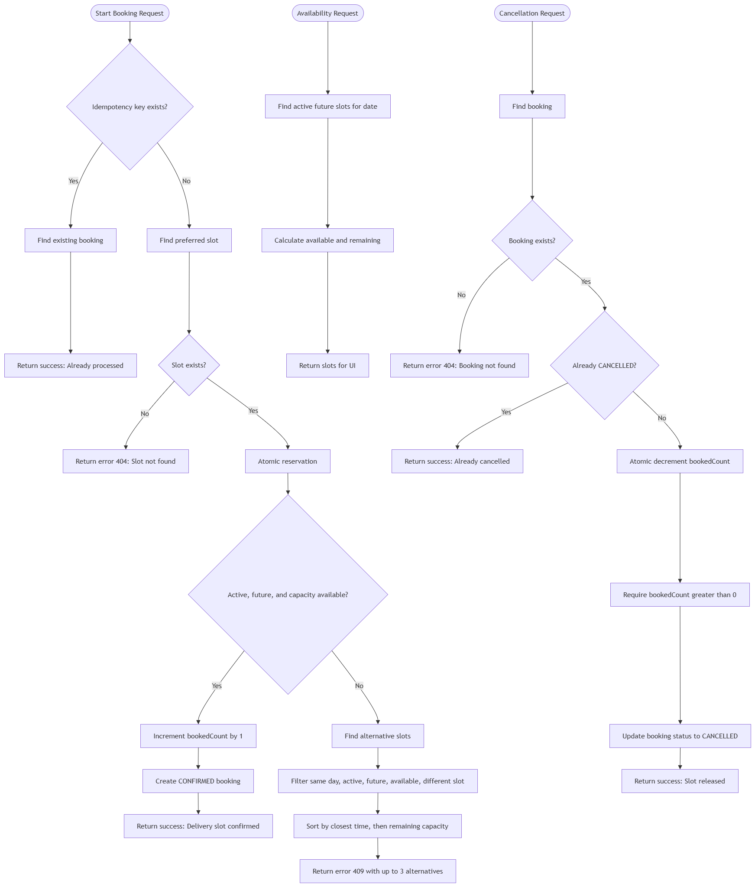

# Turuq Task Backend

A modular, secure RESTful API for managing user profiles (Task 1: User Data Handling).

- **Deployed API:** https://courses-api-tgga.onrender.com
- **Health check:** https://courses-api-tgga.onrender.com/health
- **API documentation (Postman):** https://documenter.getpostman.com/view/30055418/2sBYArUsVj

> **Note about the deployed URL:** the Render service keeps its original name
> (`courses-api-tgga`), so the URL differs from the repo name (`turuq`). The service
> can't be renamed without creating a new (paid) Render project — only the repository
> was renamed. All endpoints below are relative to this base URL.

## Features

- JWT authentication (httpOnly cookie + bearer token) with login, register, logout and "me"
- User CRUD **restricted to admins only** (role-based access control)
- Pagination plus optional exact-age (`age`) and range (`minAge`/`maxAge`) filters
- Zod schema validation with input sanitization on every endpoint
- Security hardening: Helmet, CORS, express-rate-limit, no dynamic query strings (MongoDB ⇒ no SQL injection surface)
- Graceful, consistent error handling for operational and programming errors
- Jest + supertest integration tests using an in-memory MongoDB

## Tech Stack

| Layer        | Technology                                        |
| ------------ | ------------------------------------------------- |
| Runtime      | Node.js + TypeScript (Express 5)                  |
| Database     | MongoDB via Mongoose 9                            |
| Validation   | Zod 4                                             |
| Auth         | JWT (jsonwebtoken) + bcryptjs password hashing    |
| Security     | Helmet, CORS, express-rate-limit, sanitization    |
| Testing      | Jest + supertest + mongodb-memory-server          |

## API Reference

All routes are mounted under `https://courses-api-tgga.onrender.com`. User routes
require a valid JWT and the **`admin`** role.

| Method   | Route                       | Access       | Description                                                        |
| -------- | --------------------------- | ------------ | ------------------------------------------------------------------ |
| `GET`    | `/health`                   | Public       | Health check — `{ "message": "API is running ✅" }`                 |
| `POST`   | `/api/v1/auth/register`     | Public       | Create account (`name`, `email`, `password`; `age`/`role` optional) |
| `POST`   | `/api/v1/auth/login`        | Public       | Log in and get a JWT                                                |
| `POST`   | `/api/v1/auth/logout`       | Public       | Clear the JWT cookie                                                |
| `GET`    | `/api/v1/auth/me`           | Auth         | Current user's profile                                              |
| `POST`   | `/api/v1/users`             | Admin        | Create a user profile (`name`, `email`, `password` required)        |
| `GET`    | `/api/v1/users`             | Admin        | List profiles — paginated, optional age filters (see below)         |
| `GET`    | `/api/v1/users/:id`         | Admin        | Fetch one profile by id                                             |
| `PUT`    | `/api/v1/users/:id`         | Admin        | Update name/email/age/role (partial updates supported)              |
| `DELETE` | `/api/v1/users/:id`         | Admin        | Delete a profile (204)                                              |

### List query parameters — `GET /api/v1/users`

| Param    | Type   | Description                                       |
| -------- | ------ | ------------------------------------------------- |
| `page`   | number | Page number, starts at 1 (default `1`)            |
| `limit`  | number | Items per page, max `100` (default `10`)          |
| `age`    | number | Exact age filter (1–100)                          |
| `minAge` | number | Minimum age filter (1–100)                        |
| `maxAge` | number | Maximum age filter (1–100)                        |

Response envelope for the list: `status`, `results`, `total`, `page`, `limit`, `totalPages`, `data`.

### Authentication

- Register/login set an **httpOnly, `sameSite=strict` JWT cookie** and also return an
  `accessToken` in the response body.
- To call user routes you need an **admin** account:
  - From the seed script — `user1@example.com` / `password123` (see below), or
  - Pass `role: "admin"` when creating/updating a user via the API.
- Non-admin tokens receive `403 Forbidden` on `/api/v1/users*`.

### User profile fields

| Field       | Type      | Required | Notes                                  |
| ----------- | --------- | -------- | -------------------------------------- |
| `id`        | string    | auto     | MongoDB ObjectId                       |
| `name`      | string    | ✅       | 3–50 chars, trimmed                    |
| `email`     | string    | ✅       | unique, lowercase, validated           |
| `age`       | number    | —        | integer 1–100, indexed                 |
| `role`      | string    | —        | `admin` or `user`, default `user`      |
| `password`  | string    | ✅       | min 8 chars, bcrypt-hashed, **never returned** |
| `createdAt` | timestamp | auto     | managed by Mongoose `timestamps`       |
| `updatedAt` | timestamp | auto     | managed by Mongoose `timestamps`       |

### Errors

Errors return a JSON body in the shape `{ "status": "fail" | "error", "message": "..." }`.

| Status | Meaning                                          |
| ------ | ------------------------------------------------ |
| 400    | Validation failure or malformed `:id`            |
| 401    | Missing/invalid/expired token or bad credentials |
| 403    | Authenticated but not an admin                   |
| 404    | Resource not found                               |
| 409    | Duplicate value (e.g. email already registered)  |
| 429    | Too many requests (rate limited)                 |
| 500    | Server error                                     |

### Rate limiting

- `/api/v1/auth*` — **20 requests / 15 minutes** (slows credential stuffing)
- `/api/v1*` — **300 requests / 15 minutes** (general API protection)

## Getting Started

```bash
npm install
cp .env.example .env   # fill in the variables (see below)
npm run dev            # start with hot reload
```

Optional:

```bash
npm run seed   # creates 50 users; first one is admin (user1@example.com / password123)
npm test       # run the Jest integration suite
```

> ⚠️ The seed script **deletes all existing users** before inserting sample data.

## Environment Variables

| Variable                | Required | Description                                  |
| ----------------------- | -------- | -------------------------------------------- |
| `PORT`                  | —        | Server port (default `3000`; Render sets it) |
| `NODE_ENV`              | ✅       | `development`, `production` or `test`        |
| `MONGODB_URI`           | ✅       | MongoDB connection string (Atlas)            |
| `JWT_SECRET`            | ✅       | JWT signing secret (min 10 characters)       |
| `JWT_EXPIRES_IN`        | —        | Token lifetime, e.g. `1d`                    |
| `JWT_COOKIE_EXPIRES_IN` | —        | Cookie lifetime in days (default `1`)        |

## Deploying on Render

The repository includes a `render.yaml` Blueprint for a Node web service. In Render:

1. Create a Blueprint from this repository.
2. Enter the MongoDB Atlas connection string when prompted for `MONGODB_URI`.
3. Let Render generate `JWT_SECRET`, or set your own secret with at least 10 characters.
4. Deploy the service. Render uses `npm ci --include=dev && npm run build` to build it and `npm start` to run it.

Before deploying, add the Render service's outbound IP addresses to the MongoDB Atlas Network Access list.

- The service health check is `GET /health`.
- Render supplies `PORT` automatically; do not add a fixed production port.
- The Blueprint intentionally does not run the seed command because it deletes existing users before inserting sample data.

> The deployed service's name/URL is `courses-api-tgga` (see the note at the top) —
> this is fixed and cannot be renamed without creating a new paid project.

## Project Structure

```
src/
├── app.ts               # express app, security middleware, rate limiting
├── server.ts            # bootstrap + graceful shutdown
├── config/              # env validation, MongoDB connection, seed script
├── controllers/         # auth + user CRUD handlers
├── middleware/          # protect (JWT), restrictTo (roles), validate (Zod + sanitize), rateLimiter, errorHandler, notFound
├── models/              # Mongoose schema + indexes
├── routes/              # auth + user routers
├── types/               # shared TS interfaces + express.d.ts
├── utils/               # AppError, JWT helpers, sanitizeData
└── validators/          # Zod schemas per endpoint

tests/                   # Jest + supertest integration tests (mongodb-memory-server)
├── auth.test.ts
├── users.test.ts
├── db.ts
├── setupEnv.ts
├── transform.js
└── utils.ts

Root config: render.yaml, .env.example, jest.config.js, tsconfig.json, .eslintrc.json, .prettierrc
```

## Task 2: Handling Delivery Slots (Design & Logic)

The solution for Task 2 focuses on dynamic delivery slot allocation, race condition prevention (overbooking), idempotency, and suggesting alternatives.

### System Architecture & Workflow Diagram



> **Key Highlights:**
> - **Atomic Operations:** Uses conditional updates (`bookedCount < capacity`) to eliminate race conditions without complex locking.
> - **Idempotency:** Protects against duplicated submissions on retries using `idempotencyKey`.
> - **Smart Alternatives:** Auto-suggests the closest available slots on the same day if the preferred slot is full.
> - **Capacity Release:** Safe cancellation logic guarded by `bookedCount > 0`.
